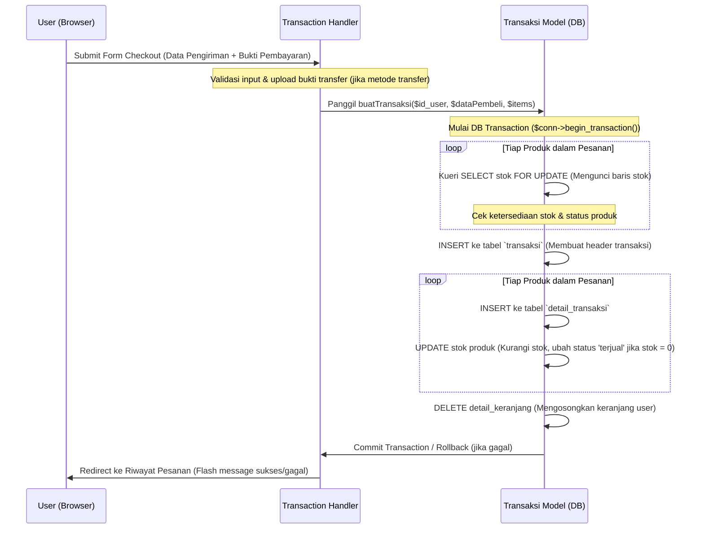

# PANDUAN BELAJAR & PRESENTASI PROYEK: HAY FARM
Selamat datang di panduan belajar privat Anda! Dokumen ini disusun khusus untuk membantu Anda memahami seluruh aspek teknis dan konseptual dari proyek **"HAY FARM"** agar Anda siap 100% untuk presentasi besok di hadapan dosen penguji.

---

## 1. GAMBARAN BESAR PROJECT

### A. Tujuan & Fungsi Sistem
**Hay Farm** adalah sebuah sistem informasi manajemen peternakan sekaligus platform e-commerce terintegrasi. Sistem ini dibuat untuk menyelesaikan dua masalah utama:
1. **Manajemen Peternakan (Back-end Management)**: Memudahkan pengelolaan data hewan ternak (sapi perah dan sapi PO), mencakup pelacakan kesehatan harian dan siklus reproduksi (Inseminasi Buatan).
2. **Penjualan Langsung (E-Commerce)**: Menghubungkan peternakan langsung ke pembeli untuk menjual produk peternakan seperti hewan hidup (sapi), susu segar, dan rumput pakan tanpa perantara.

### B. Peran Pengguna (Role-Based Access Control)
Sistem memiliki 3 role utama yang didefinisikan dalam tabel `user` di database:
1. **Pembeli (User / Pembeli)**:
   * Mengakses katalog produk peternakan.
   * Melakukan pemesanan (keranjang & checkout).
   * Memilih metode pembayaran: **Transfer Bank** (harus upload bukti transfer) atau **COD (Cash on Delivery)**.
   * Melihat riwayat transaksi dan status pemesanan.
2. **Admin**:
   * Melakukan CRUD (Create, Read, Update, Delete) data produk (susu, rumput, sapi).
   * Melakukan CRUD data hewan ternak (sapi perah & sapi PO) beserta foto hewan.
   * Melakukan CRUD data kesehatan hewan & reproduksi (Inseminasi Buatan).
   * Memverifikasi transaksi pembeli (menerima atau menolak transaksi). Jika ditolak, sistem otomatis mengembalikan stok produk (restore stock).
3. **Manager**:
   * Memantau performa peternakan melalui grafik/chart interaktif (populasi hewan, kesehatan, reproduksi, tren penjualan bulanan).
   * Mengunduh laporan berkala (laporan populasi, kesehatan, dan transaksi) dalam format PDF menggunakan library **DOMPDF**.

---

## 2. PENJELASAN STRUKTUR FOLDER

Berikut adalah peta struktur folder proyek Anda beserta hubungan fungsionalnya:

```
HayFarm/
├── config/                  # Konfigurasi sistem
│   └── database.php         # Koneksi database menggunakan OOP MySQLi
├── process/                 # Lapisan logika bisnis (Backend Logic)
│   ├── auth/                # Autentikasi sistem (Login & Register)
│   │   └── Auth.php         # Class OOP Auth untuk menangani login & register
│   ├── models/              # Model data OOP (Akses & manipulasi tabel DB)
│   │   ├── produk.php       # Query & logika bisnis produk
│   │   ├── hewan.php        # Query & logika bisnis ternak
│   │   ├── kesehatan.php    # Query & logika bisnis kesehatan hewan
│   │   ├── reproduksi.php   # Pelacakan Inseminasi Buatan
│   │   ├── keranjang.php    # Operasi keranjang belanja pembeli
│   │   ├── transaksi.php    # Logika pembuatan & verifikasi transaksi (krusial!)
│   │   └── dashboard_admin.php # Penarikan statistik dashboard admin
│   └── handlers/            # Pengolah aksi (Action Handlers/Controller)
│       ├── produk_handler.php
│       ├── hewan_handler.php
│       ├── kesehatan_handler.php
│       ├── cart_handler.php # AJAX handler untuk tambah/update/hapus keranjang
│       ├── transaction.php  # Memproses checkout form & upload bukti transfer
│       └── verifikasi_handler.php # Verifikasi transaksi oleh admin
├── pages/                   # Lapisan tampilan (View Layer)
│   ├── user/                # Halaman pembeli (home, produk, keranjang, checkout, riwayat)
│   ├── admin/               # Dashboard admin & manajemen data (CRUD)
│   └── manager/             # Halaman analisis & ekspor laporan PDF manager
├── components/              # Komponen UI modular (Header, Footer, Navbar, Sidebar)
├── public/                  # Aset statis frontend (CSS, JS, Images, SVG)
├── uploads/                 # Folder penyimpanan file dinamis (Foto hewan, Bukti transfer)
├── database/                # Skema database SQL
└── index.php                # Entry point utama & router untuk halaman user
```

### Bagaimana Folder Saling Berhubungan?
1. **Halaman Frontend (`pages/`)** berinteraksi dengan pengguna.
2. Ketika ada aksi form submit atau tombol diklik, request dikirim ke **Handlers (`process/handlers/`)**.
3. **Handlers** bertugas memvalidasi input dasar (seperti upload file) dan memanggil **Models (`process/models/`)** untuk berinteraksi dengan database.
4. **Models** mengeksekusi Query SQL yang aman (Prepared Statements) melalui koneksi terpusat di **`config/database.php`**.

---

## 3. PENJELASAN FRONTEND (VIEW LAYER)

### A. Teknologi & Framework
* **Bootstrap 5**: Digunakan sebagai framework CSS utama untuk grid layout, responsive design, tombol, form, modal, dan tabel.
* **Vanilla CSS**: Digunakan untuk kustomisasi tema visual khas "Hay Farm" (warna hijau alam/peternakan, bayangan halus, tata letak kartu produk).
* **JavaScript & AJAX (Fetch/jQuery)**: Berperan sangat penting dalam meningkatkan UX (User Experience). Contoh utama: tambah produk ke keranjang, ubah jumlah produk di keranjang, dan hapus item dilakukan **secara real-time tanpa me-refresh halaman** menggunakan AJAX.
* **Chart.js**: Library JavaScript di dashboard admin dan manager untuk merender grafik lingkaran (pie) dan garis (line) secara dinamis dari data database.

### B. UI Flow (Alur Antarmuka)
```
[Halaman Home] ── (Klik "Lihat Produk") ──> [Halaman Katalog Produk] 
                                                    │
                                            (Klik "Beli" / AJAX)
                                                    │
                                                    ▼
[Halaman Checkout] <── (Klik "Checkout") <── [Halaman Keranjang (AJAX)]
        │
 (Upload Bukti / COD) ──> [Halaman Riwayat Pesanan (Status: Menunggu Verifikasi)]
```

---

## 4. PENJELASAN BACKEND (LOGIC LAYER)

Proyek ini menggunakan arsitektur **Hybrid (Campuran)**, yaitu gabungan antara **OOP (Object-Oriented Programming)** pada Model data dan koneksi database, serta **Procedural/Structured** pada halaman tampilan dan file router.

### A. Mekanisme Routing (`index.php`)
File `index.php` bertindak sebagai **Front Controller** untuk halaman user (pembeli).
1. Menginisialisasi session (`session_start()`).
2. Menangkap parameter nama halaman dari URL (`index.php?page=user/produk`).
3. Mencocokkan nama halaman dengan **Whitelist Array** untuk mencegah eksploitasi file inclusion (`LFI`).
4. Memasukkan CSS yang sesuai secara otomatis (`$page_css`).
5. Menyertakan header, navbar, meng-include file halaman tujuan dari folder `pages/`, dan diakhiri dengan menyertakan footer.

### B. Koneksi Database OOP (`config/database.php`)
Database dibungkus dalam kelas `Database` menggunakan ekstensi **MySQLi OOP**.
```php
class Database {
    private string $host = "localhost";
    private string $user = "root";
    private string $pass = "";
    private string $db = "hayfarm";
    public mysqli $conn;

    public function __construct() {
        mysqli_report(MYSQLI_REPORT_OFF); // Mematikan exception error bawaan PHP demi keamanan
        $this->conn = new mysqli($this->host, $this->user, $this->pass, $this->db);
        if ($this->conn->connect_errno) {
            die('Koneksi database gagal: ' . $this->conn->connect_error);
        }
        $this->conn->set_charset('utf8mb4');
    }
    public function getConnection(): mysqli {
        return $this->conn;
    }
}
```
*Mengapa menggunakan `set_charset('utf8mb4')`?* Agar database mendukung karakter unicode penuh (termasuk emoji jika ada data deskripsi).

### C. Session & Keamanan Autentikasi (`process/auth/Auth.php`)
Saat user melakukan login:
1. Input email dan password dibersihkan (`trim`).
2. Kueri disiapkan menggunakan **Prepared Statement** untuk mencegah *SQL Injection*.
3. Sistem mengambil hash password pembeli dari database dan mengecek keabsahannya dengan `password_verify($password, $user['password'])`.
4. Jika valid, sistem memanggil `session_regenerate_id(true)` untuk **mencegah serangan Session Fixation** (pembajakan sesi), kemudian menyimpan data identitas user ke dalam variable global `$_SESSION` (`id_user`, `username`, `email`, `role`, dan `login` status).

---

## 5. ALUR TRANSAKSI USER (CHECKOUT FLOW)

Ini adalah bagian yang paling sering ditanyakan dosen. Anda harus memahami alur data bergerak dari keranjang sampai ke pembayaran secara rinci:



### Penjelasan Detil Langkah Krusial:
1. **Upload Bukti Transfer**:
   Jika pembeli memilih metode transfer, file bukti pembayaran diunggah ke server. Handler memvalidasi tipe file (hanya JPG, JPEG, PNG) dan membatasi ukuran maksimal (5MB). Nama file diganti menjadi format acak/unik untuk menghindari tabrakan nama file di direktori `uploads/bukti/`.
2. **Database Transaction (`BEGIN`, `COMMIT`, `ROLLBACK`)**:
   Untuk menjamin konsistensi data (agar tidak ada kasus uang ditransfer tapi stok tidak berkurang, atau detail transaksi gagal disimpan tapi keranjang sudah terlanjur kosong), database menggunakan sistem transaksi SQL. Jika salah satu query gagal di tengah jalan, seluruh operasi dibatalkan (`ROLLBACK`), jika semua sukses baru disimpan permanen (`COMMIT`).
3. **Pemberatan Stok (`FOR UPDATE`)**:
   Model menggunakan klausa SQL `FOR UPDATE` saat memeriksa stok. Ini mengunci baris data produk tersebut di tingkat database agar tidak dapat dimodifikasi oleh user lain selama transaksi checkout ini berlangsung, menghindari masalah **Race Condition** (dua pembeli membeli barang terakhir di waktu yang sama).

---

## 6. ALUR KERJA ADMIN (CRUD & VERIFIKASI)

### A. CRUD Produk
1. **Create**: Admin memasukkan nama, harga, stok, satuan, jenis, dan tanggal kedaluwarsa. Jika jenisnya adalah "hewan", admin wajib memilih ID hewan dari daftar ternak yang berstatus "produktif" dan belum dikaitkan dengan produk lain.
2. **Read**: Data ditampilkan di tabel manajemen produk.
3. **Update**: Mengubah harga atau menambah stok.
4. **Delete**: Sebelum menghapus produk, sistem melakukan pemeriksaan: jika produk tersebut pernah dibeli (ada di `detail_transaksi`), produk **tidak boleh dihapus** agar tidak merusak data laporan keuangan. Sebagai gantinya, status produk diubah menjadi tidak aktif / terjual.

### B. CRUD Data Hewan & Foto Upload
* Foto hewan diunggah ke folder `uploads/hewan/`.
* Query database menyimpan path relatif foto tersebut (misal: `uploads/hewan/hewan_1716123456_664a7c8.png`).
* Hapus hewan akan gagal secara otomatis oleh foreign key constraint jika hewan tersebut memiliki riwayat kesehatan atau reproduksi di tabel lain.

### C. Alur Verifikasi Transaksi (Diterima / Ditolak)
Di halaman `verifikasi_penjualan.php`, admin meninjau bukti transfer.
* **Jika Verifikasi Diterima**: Status diubah dari `menunggu_verifikasi` menjadi `telah_dikonfirmasi`.
* **Jika Verifikasi Ditolak (Batalkan)**: Status diubah menjadi `dibatalkan`. Logika backend memanggil metode `restoreStokProduk()` yang akan melakukan perulangan untuk mengembalikan stok produk yang terlanjur dikurangi saat pembeli melakukan checkout, dan mengubah status produk kembali menjadi `blm_terjual` jika stok bertambah dari 0.

---

## 7. ALUR KERJA MANAGER (ANALITIK & PDF)

### A. Dashboard & Statistik
Manager tidak melakukan CRUD, melainkan memantau statistik. Data statistik diambil menggunakan fungsi agregasi SQL (`COUNT`, `SUM`, `GROUP BY`):
1. **Statistik Populasi**: Mengelompokkan hewan berdasarkan jenisnya.
2. **Tren Penjualan**: Menghitung omzet bulanan dari transaksi yang berstatus `telah_dikonfirmasi`.

### B. Mekanisme Ekspor PDF (DOMPDF)
Manager dapat mengekspor Laporan Populasi, Kesehatan, dan Transaksi ke format PDF.
* **DOMPDF** bekerja dengan cara menangkap output HTML & CSS (yang disusun di halaman web laporan) menggunakan fungsi buffer output PHP (`ob_start()` dan `ob_get_clean()`).
* String HTML yang telah ditangkap kemudian diproses oleh engine DOMPDF untuk dirender menjadi file PDF siap unduh.

---

## 8. STRUKTUR DATABASE & RELASI

Tabel database dirancang dengan aturan integritas data yang ketat menggunakan **Foreign Key (FK)**.

```
+--------------------+
|        user        |
+--------------------+
| id_user (PK)       |<-----+
| username           |      |
| email              |      |
| password (bcrypt)  |      |
| role               |      |
+--------------------+      |
                            |
+--------------------+      |
|     transaksi      |      |
+--------------------+      |
| id_transaksi (PK)  |      |
| id_user (FK) ------|------+
| total_tagihan      |
| status_transaksi   |
+--------------------+
          |
          v
+--------------------+
|  detail_transaksi  |
+--------------------+
| id_detail_tx (PK)  |
| id_transaksi (FK)  |
| id_produk (FK) ----|------+
| jumlah, sub_total  |      |
+--------------------+      |
                            |
+--------------------+      |
|    data_produk     |      |
+--------------------+      |
| id_produk (PK) <---|------+
| id_hewan (FK) -----|------+
| jenis_produk       |      |
| harga, stok        |      |
+--------------------+      |
                            |
+--------------------+      |
|    data_ternak     |      |
+--------------------+      |
| id_hewan (PK) <----|------+
| kode_hewan (Unique)|      |
| jenis_hewan        |      |
| status_hewan       |      |
+--------------------+      |
      |          |          |
      |          +----------|--+
      v                     |  |
+--------------------+      |  |
|   data_kesehatan   |      |  |
+--------------------+      |  |
| id_kesehatan (PK)  |      |  |
| id_hewan (FK) -----|------+  |
| status_kesehatan   |         |
| diagnosis          |         |
+--------------------+         |
      |                        |
      v                        v
+--------------------+   +--------------------+
|  data_reproduksi   |   |  data_reproduksi   |
|     (via Kes)      |   |     (direct FK)    |
+--------------------+   +--------------------+
| id_reproduksi (PK) |   | id_reproduksi (PK) |
| id_kesehatan (FK)  |   | id_hewan (FK) -----|
| status_ib          |   | status_ib          |
+--------------------+   +--------------------+
```

### Relasi Cascading:
* Penghapusan hewan (`data_ternak`) akan menghapus semua riwayat kesehatannya (`data_kesehatan`) secara otomatis (`ON DELETE CASCADE`).
* Penghapusan user atau produk tidak diizinkan secara langsung jika sudah memiliki transaksi berjalan guna menjaga keakuratan histori audit keuangan.

---

## 9. KUERI DATABASE PENTING (DIJAMIN DITANYA DOSEN)

### A. Kueri Menghitung Omzet Penjualan Bulanan (Grafik Transaksi Admin/Manager)
Kueri ini digunakan untuk menggambar Line Chart pertumbuhan omzet per bulan.
```sql
SELECT 
    MONTH(tgl_transaksi) AS bulan, 
    SUM(total_tagihan) AS total_omzet 
FROM transaksi 
WHERE status_transaksi = 'telah_dikonfirmasi' 
  AND YEAR(tgl_transaksi) = 2026 
GROUP BY MONTH(tgl_transaksi) 
ORDER BY bulan ASC;
```
* **Fungsi**: Mengelompokkan pesanan yang dikonfirmasi berdasarkan bulannya, lalu menjumlahkan (`SUM`) total tagihannya.

### B. Kueri Mengambil Detail Riwayat Kesehatan Hewan yang Terjual
Digunakan pada riwayat belanja pembeli agar pembeli mengetahui rekam medis sapi yang dibelinya.
```sql
SELECT 
    dt.id_detail_transaksi,
    p.nama_produk,
    ternak.kode_hewan,
    (SELECT GROUP_CONCAT(
        CONCAT('(', k.tgl_pemeriksaan, ') ', k.status_kesehatan, ': ', k.diagnosis)
        ORDER BY k.tgl_pemeriksaan DESC SEPARATOR ' | '
     )
     FROM data_kesehatan k 
     WHERE k.id_hewan = p.id_hewan 
     LIMIT 1) AS riwayat_kesehatan
FROM detail_transaksi dt 
LEFT JOIN data_produk p ON dt.id_produk = p.id_produk 
LEFT JOIN data_ternak ternak ON p.id_hewan = ternak.id_hewan 
WHERE dt.id_transaksi = ?;
```
* **Teknik**: Menggunakan **Subquery** dan **`GROUP_CONCAT`** untuk menggabungkan banyak baris catatan kesehatan hewan menjadi satu baris teks panjang yang rapi dibatasi tanda ` | `.

---

## 10. POTENSI BUG & TECHNICAL DEBT (UTANG TEKNIS)

Sebagai mahasiswa tingkat lanjut, Anda akan mendapat nilai **A+** jika berani menjelaskan kelemahan sistem Anda sendiri sebelum dosen menemukannya. Berikut hal-packages yang bisa Anda jelaskan dengan gaya edukatif:

1. **Belum Ada Proteksi CSRF (Cross-Site Request Forgery)**:
   * *Masalah*: Form POST (seperti checkout atau hapus produk) belum menggunakan CSRF Token. Hacker bisa merekayasa link untuk mengeksekusi aksi berbahaya jika admin sedang login.
   * *Solusi Edukatif*: "Di masa depan, kami akan menambahkan token acak unik di session user yang divalidasi setiap kali ada request POST."
2. **Kurangnya Output Sanitization (Kerentanan XSS)**:
   * *Masalah*: Data dari database (seperti nama produk atau nama pembeli) langsung dirender ke HTML menggunakan `<?= $data ?>` tanpa pembungkus `htmlspecialchars()`. Jika pembeli nakal mendaftar dengan nama mengandung script JS (`<script>alert('XSS')</script>`), script tersebut akan berjalan di browser admin.
   * *Solusi Edukatif*: "Untuk mencegah XSS (Cross-Site Scripting), semua output variabel user harus dibungkus fungsi `htmlspecialchars($var, ENT_QUOTES, 'UTF-8')`."
3. **Session yang Tidak Memiliki Timeout**:
   * *Masalah*: Sekali user/admin login, sesi mereka akan aktif selamanya di browser selama cookie session tidak dihapus.
   * *Solusi*: "Perlu ditambahkan pengecekan waktu aktivitas terakhir (`last_activity`) di session, sehingga jika tidak ada aktivitas selama 30 menit, user otomatis logout."
4. **Duplicate Code pada Format Rupiah**:
   * *Masalah*: Fungsi `formatRupiah()` dideklarasikan ulang di beberapa file terpisah (seperti model keranjang dan riwayat).
   * *Solusi*: "Ini adalah Technical Debt. Seharusnya fungsi pembantu ini dipusatkan dalam satu file utilitas (misal: `process/utils/helper.php`) lalu di-include saat dibutuhkan."

---

## 11. STRATEGI PRESENTASI & PREDIKSI PERTANYAAN DOSEN

### A. Cara Menjelaskan Proyek saat Presentasi (Garis Besar ke Detail)
1. **Buka dengan Masalah**: *"Peternak lokal sering kesulitan mengelola rekam medis hewan mereka secara rapi sekaligus memotong jalur tengkulak untuk menjual produknya. Hay Farm hadir sebagai solusi digital terintegrasi..."*
2. **Demokan Flow User (Happy Path)**: Demo belanja dari register -> tambah ke keranjang -> checkout -> upload bukti transfer.
3. **Pindah ke Sisi Admin**: Tunjukkan halaman verifikasi penjualan, lalu verifikasi pembayaran tadi. Jelaskan bagaimana stok sapi otomatis terpotong saat pesanan diterima.
4. **Tunjukkan Sisi Manager**: Jelaskan grafik populasi dan demo ekspor PDF laporan dengan DOMPDF.
5. **Jelaskan Arsitektur**: Jelaskan bahwa project dibuat dengan PHP Native menggunakan pendekatan OOP pada model data demi menjaga keamanan (Prepared Statements) dan kerapian kode.

### B. Prediksi Pertanyaan Dosen & Cara Menjawabnya

#### Pertanyaan 1: "Bagaimana cara sistem Anda mencegah pembeli memesan sapi yang stoknya sudah habis?"
* **Jawaban**: *"Kami menerapkan tiga lapis keamanan. Pertama di frontend, tombol beli dinonaktifkan jika stok 0. Kedua, di handler keranjang belanja. Ketiga, di tingkat database saat transaksi checkout, kami menggunakan query `SELECT FOR UPDATE` untuk mengunci baris produk tersebut. Jika stok tidak mencukupi setelah diperiksa di database, transaksi akan langsung dibatalkan (`ROLLBACK`) dan melempar pesan error ke user."*

#### Pertanyaan 2: "Mengapa Anda menggunakan model OOP tetapi routernya procedural (`index.php?page=...`)?"
* **Jawaban**: *"Pendekatan hybrid ini kami pilih untuk menyeimbangkan kecepatan pengembangan dengan keamanan data. Lapisan Model dan Koneksi Database wajib menggunakan OOP karena kami memerlukan enkapsulasi data dan Prepared Statements untuk keamanan query dari serangan SQL Injection. Sedangkan untuk routing tampilan, penggunaan procedural `index.php` dengan whitelist LFI sudah cukup cepat, ringan, dan efektif untuk lingkup proyek semester ini."*

#### Pertanyaan 3: "Bagaimana cara kerja library DOMPDF dalam mencetak laporan?"
* **Jawaban**: *"DOMPDF bekerja dengan membaca markup HTML dan CSS. Di file `export_report.php`, kami menangkap output visual tabel laporan menggunakan fungsi output buffering PHP (`ob_start()`), kemudian mengirimkan string HTML tersebut ke objek DOMPDF melalui metode `$dompdf->loadHtml()`, lalu memanggil metode `$dompdf->render()` untuk mengonversinya menjadi dokumen PDF dinamis."*

#### Pertanyaan 4: "Jika transaksi dibatalkan oleh admin, apa yang terjadi pada stok barang?"
* **Jawaban**: *"Logika backend pada metode `updateStatusTransaksi()` di model `Transaksi` akan mendeteksi jika parameter status yang dikirim admin bernilai 'dibatalkan'. Jika ya, sistem otomatis memanggil fungsi `restoreStokProduk()` yang akan meng-UPDATE jumlah stok barang di tabel `data_produk` ditambah sebanyak jumlah yang sempat dibeli pada transaksi tersebut, lalu mengembalikan status produk menjadi 'blm_terjual' jika sebelumnya habis."*

---

Dengan memahami panduan ini, Anda sudah menguasai arsitektur, alur data, logika kode, dan titik kritis dari aplikasi **Hay Farm**. Selamat belajar dan semoga presentasi Anda sukses besok! 🚀
